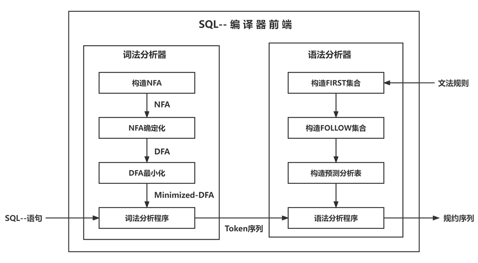

# README

# 项目介绍

使用Python实现的SQL--语言的编译器前端，能够对读入的SQL语句进行词法分析和语法分析并输出Token序列和规约序列。

# 需求分析

本次大作业的要求是编写一个SQL--语言的编译器前端（包括词法分析器和语法分析器）：

1）使用自动机理论编写词法分析器

2）自上而下或者自下而上的语法分析方法编写语法分析器

### 1. 词法分析器

使用实现有限自动机确定化，最小化算法类来构造用于识别token的DFA。并用该DFA来构造词法分析器。词法分析器的输入为 SQL语言源代码，输出识别出单词的二元属性。

单词符号的类型包括关键字，标识符，界符，运算符，整数，浮点数，字符串。

### 2. 语法分析器

根据给定的文法规则完成SQL--语言的语法分析器，语法分析器的输入为SQL--代码的 Token序列，输出用最左推导或规范规约产生语法树所用的产生式序列。SQL--语言文法须包含以下操作：

① 查询语句；

② 插入语句；

③ 更新语句；

④ 删除语句；

⑤ 表连接操作（JOIN, LEFT JOIN, RIGHT JOIN）

⑥ 聚合操作（MIN，MAX，SUM）

⑦ 组操作（GROUP BY，HAVING，ORDER BY，DISTINCT）

⑧ 集合操作（UNION，UNION ALL）

# 概要设计

在本次实验中我们选择使用Python语言来实验SQL--语言的编译器。通过仔细分析本次实验的需求，我们得到了如下的设计流程图：

整个项目主要由以下几个部分组成，下面给出每个部分的主要任务和工作做流程。

### 1. 词法分析器(Lexer.py)一共包含四个类，这些类的主要作用如下：

1）Token：存储词法分析生成的每一个Token

2）NFA：存储NFA，实现NFA的确定化

3）DFA：存储DFA，实现DFA的最小化

4）Lexer：读入输入串和最小化的DFA ，进行词法分析并输出Token序列

### 2. 语法分析器(Parser.py)包含一个Parser类，Parser类的主要作用如下：

1）读入LL(1)文法规则，生成FIRST和FOLLOW集合

2）根据FIRST和FOLLOW集合构造预测分析表

3）根据预测分析表对词法分析器输出的Token序列进行语法分析并输出规约序列

### 3. 编译器前端(main.py) 的主要作用如下：

1）调用Lexer.py和Parser.py中的类来整合实现编译器前端

2）从文本或者终端中获取输入语句后启动词法分析器和语法分析器来完成词法和语法分析工作

# 运行方式

下载代码后运行main.py函数，此编译器前端提供了两种输入SQL语句的方法，一种是从文件中读取，另一种是从终端读取。在运行main.py文件后输出以下内容：

根据提示输入1或2来选择对应的输入方式。

### 1. 从文件中读取

在测试前需要将待测的文件存入Compiler_Front-end_Project\Test\Input文件夹中，根据提示输入文件名后就可以进行词法和语法分析。分析后的结果会存入Compiler_Front-end_Project\Test\Output文件夹中。

### 2. 从终端读取

选择2后，只需在终端输入SQL语句就可以进行词法和语法分析，分析后的结果会存入Compiler_Front-end_Project\Test\Output文件夹中。